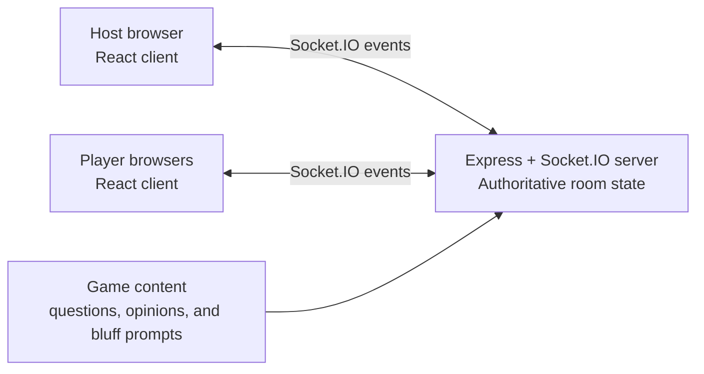

# Game Night

A real-time multiplayer party-game platform for playing with family and friends in the same room. One device acts as the host screen while each player joins from their phone or browser using a four-letter room code. No accounts or app installation are required.

The host currently chooses between five games:

- **The 1% Club** — an elimination quiz based on logic, observation, and common sense.
- **Majority Rules** — an opinion game where players score by matching the room's most popular answer.
- **Bluff Battle** — a social bluffing game where players invent fake answers, find the truth, and fool one another.
- **Million Ladder** — one contestant climbs through 15 questions while the host runs the show and the audience can help.
- **Survey Showdown** — two teams uncover popular survey answers while managing strikes and steals.

> The 1% Club mode is an unofficial fan project and is not affiliated with or endorsed by the television programme or its owners.

## How the games work

### Majority Rules

Each game contains eight randomly selected opinion rounds.

1. The host creates a Majority Rules room and shares its code.
2. Players privately choose the answer they think most of the room will select.
3. Votes lock immediately and cannot be changed.
4. The host reveals the vote distribution.
5. Every player who matched the most popular answer receives one point.
6. If multiple answers tie for the most votes, each tied answer scores.
7. The player or players with the highest score after eight rounds win.

### The 1% Club

Each game contains ten questions, one for every difficulty level:

`90% → 80% → 70% → 60% → 50% → 40% → 30% → 20% → 10% → 1%`

At the beginning of a round, the server randomly chooses one question at each level from the question pool.

1. The host creates a room and shares its four-letter code.
2. Players join the lobby from their own devices.
3. The host starts the game and controls when answers are revealed.
4. Each active player submits one multiple-choice or written answer.
5. Answers lock immediately and cannot be changed.
6. When the host reveals the result, incorrect and missing answers eliminate the affected players.
7. Eliminated players remain in the room as spectators and can follow the rest of the game.
8. Any player still active after the 1% question wins.

The host can then start another round with a newly selected set of questions.

### Bluff Battle

Each game contains five unusual-fact rounds.

1. Every player writes a believable fake answer.
2. Duplicate bluffs and answers matching the truth are rejected privately.
3. The truth and submitted bluffs are shuffled together.
4. Players vote for the answer they believe is real, but cannot choose their own bluff.
5. Finding the truth earns two points.
6. Fooling another player earns one point per vote.
7. The highest score after five rounds wins.

### Million Ladder

One contestant climbs a 15-question prize ladder from `$100` to `$1,000,000`. The first player to join takes the hot seat and later players join the audience.

1. The contestant privately chooses one of four answers.
2. The host triggers lifelines and reveals the contestant's final answer.
3. Audience members vote only when Ask the Audience is used.
4. With no audience, Ask the Audience is replaced by Switch Question.
5. The three lifelines are 50:50, Ask the Audience or Switch Question, and Skip Question.
6. Only the first five questions use a 30-second timer.
7. A missed rung ends the run at the latest `$1,000` or `$32,000` safety net.
8. After a correct answer, the host can continue climbing or bank the current prize.

### Survey Showdown

Each game contains six surveys, with double points in rounds four and five and triple points in the final round.

1. Players are split evenly between the Lime Team and Violet Team.
2. One player from each team faces off. The higher-ranked answer wins control of the board.
3. The face-off winner chooses whether their team will play or pass control to their opponents.
4. The controlling team rotates through guesses while matching answers reveal their survey value.
5. After three strikes, the opposing team gets one answer to steal the round bank.
6. A successful steal takes the bank; a failed steal awards it to the team that had control.
7. The team with the highest total after six rounds wins.

## Features

- Four-letter private room codes
- Host game picker
- Separate host and contestant experiences
- Live lobby and player status updates
- Majority Rules voting, vote distributions, scoring, and leaderboard
- Bluff Battle private writing, anonymous voting, reveals, and scoring
- Million Ladder prize progression, safety nets, live room voting, and shared lifelines
- Survey Showdown team turns, answer board, strikes, steals, and score multipliers
- Multiple-choice and free-text questions
- Server-enforced answer locking
- Host-controlled answer reveals and question progression
- Automatic elimination with spectator mode
- Responsive interface designed for phones and a shared host screen
- Randomized rounds drawn from a 50-question pool
- Per-room question history prevents repeats for five full rounds
- No user accounts or database required

## Architecture

The project is a small client-server application. React renders the interface, while an Express and Socket.IO server owns the room and game state.



### Client

The browser application lives in `src/` and is built with React and Vite.

- `src/App.jsx` selects the landing, lobby, question, and results screens from the current game phase.
- `src/hooks/useGameSession.js` connects UI actions to Socket.IO events and stores the latest public room state.
- `src/socket.js` creates the shared Socket.IO client.
- `src/components/` contains shared and game-specific host/player views.
- `src/styles.css` contains the responsive visual system.

The client does not decide whether an answer is valid or whether a player remains active. It sends an action to the server and renders the state returned by the server.

### Server

`server/index.js` runs the Express HTTP server and Socket.IO realtime server. It is the authoritative source for:

- Room creation and four-letter code generation
- Player membership and connection status
- Question selection and game phases
- Answer validation and one-answer locking
- Game-specific elimination or scoring, winners, and restarts
- Broadcasting a player-specific public state after every change

The main realtime events are:

| Event | Sent by | Purpose |
| --- | --- | --- |
| `host:create` | Host | Create a room |
| `player:join` | Player | Join a room by code |
| `host:start` | Host | Begin the first question |
| `player:answer` | Player | Submit and lock an answer |
| `player:bluff` | Player | Submit and lock a fake answer |
| `player:vote` | Player | Vote for a Bluff Battle answer |
| `player:survey-guess` | Player | Submit the active player's Survey Showdown guess |
| `player:survey-control` | Player | Choose Play or Pass after winning the face-off |
| `host:ladder-lifeline` | Host | Use a shared Million Ladder lifeline |
| `host:reveal` | Host | Mark answers and eliminate players |
| `host:next` | Host | Continue or finish the round |
| `host:restart` | Host | Return to the lobby with new questions |
| `host:return-to-games` | Host | Open the room's game picker after a game |
| `host:select-game` | Host | Choose a different game while keeping the room and players |
| `room:state` | Server | Send the latest permitted state to each client |

Answers and explanations are withheld from clients until the room enters the reveal phase.

### Game data

`server/questions/onePercent/` contains the difficulty ladder and question pool. The current pool has eight questions at each of the ten difficulty levels. Questions can use:

- `choice` for selectable answers
- `input` for free-text answers
- Multiple accepted answer variants where needed

Free-text answers are normalized on the server before comparison by trimming whitespace, ignoring case and selected punctuation, and collapsing repeated spaces.

`server/questions/commonAnswer/` contains the Majority Rules opinion pool. Eight prompts are selected per game, with used prompts avoided until the 64-prompt pool is exhausted.

`server/questions/bluffBattle/` contains 60 original Bluff Battle prompts, truths, and reveal explanations. Five are selected per game.

`server/questions/millionLadder/` contains six increasingly difficult choices for every prize rung. Used questions are remembered per room so the first six complete replays do not repeat a rung's question.

`server/questions/surveyShowdown/` contains 60 original surveys with six scored answers and accepted guess variants. Six are selected per game without repeats until the pool is exhausted.

### Persistence and deployment

Rooms are stored in an in-memory `Map`. This keeps the project simple, but it also means:

- Restarting the server closes and clears every room.
- Rooms are not shared between multiple server instances.
- There is currently no reconnect or session-restoration flow for a refreshed player browser.

During development, Vite serves the React client on port `5173` and proxies Socket.IO traffic to the server on port `3001`. A single-server production deployment can still serve the compiled client through Express.

### Vercel + Render deployment

Vercel Functions cannot act as a WebSocket server, so a Vercel-only deployment is not compatible with this Socket.IO architecture. The recommended free deployment is:

- Vercel: React/Vite frontend
- Render Web Service: Express/Socket.IO backend

The repository includes `vercel.json` and `render.yaml` for this split.

1. Create a Render Web Service from the repository using the included Blueprint.
2. Set Render's `CLIENT_ORIGIN` to the final Vercel URL, such as `https://your-project.vercel.app`.
3. Deploy the frontend to Vercel.
4. Set Vercel's `VITE_SOCKET_URL` environment variable to the Render service URL, such as `https://one-percent-club-server.onrender.com`.
5. Redeploy Vercel after adding the environment variable because Vite embeds it at build time.

For Vercel preview deployments, add their exact origins to `CLIENT_ORIGIN` as a comma-separated list. Leaving `CLIENT_ORIGIN` empty permits all origins and is useful only for initial setup.

Render's free service can sleep after inactivity and may take roughly a minute to wake. Active WebSocket traffic keeps an ongoing game active, but any backend restart or redeploy clears in-memory rooms. Durable rooms would require moving room state to an external datastore and adding player session restoration.

## Tech stack

| Area | Technology | Role |
| --- | --- | --- |
| UI | React 19 | Component-based host and player interfaces |
| Frontend tooling | Vite 6 | Development server and production bundling |
| Backend | Node.js + Express 5 | HTTP server, health endpoint, and production static hosting |
| Realtime transport | Socket.IO 4 | Bidirectional room events and state broadcasts |
| Styling | CSS | Responsive layout, animation, and visual design |
| Code quality | ESLint 9 and Biome | Static analysis and linting |
| Local orchestration | concurrently | Runs the Vite and Node development servers together |

The application uses modern JavaScript ES modules throughout. It does not currently use TypeScript, a database, authentication, or an external state-management library.

## Run locally

Install the dependencies:

```bash
npm install
```

Start the client and realtime server together:

```bash
npm run dev
```

Open `http://localhost:5173` on the host device. To play across devices, connect them to the same network and open the network URL printed by Vite, then enter the room code.

You can also run each development process separately:

```bash
npm run dev:client
npm run dev:server
```

## Production build

Build the React application:

```bash
npm run build
```

Start the Express server:

```bash
npm start
```

The production server listens on port `3001` by default. Set `PORT` to use another port:

```bash
PORT=8080 npm start
```

Check that the server is running at `GET /api/health`.

## Available scripts

| Command | Description |
| --- | --- |
| `npm run dev` | Run the Vite client and Node server in watch mode |
| `npm run dev:client` | Run only the Vite development server |
| `npm run dev:server` | Run only the Node server in watch mode |
| `npm run build` | Create the production client bundle |
| `npm start` | Serve the production app and Socket.IO server |
| `npm run lint` | Run ESLint |
| `npm run lint:biome` | Run Biome lint checks |
